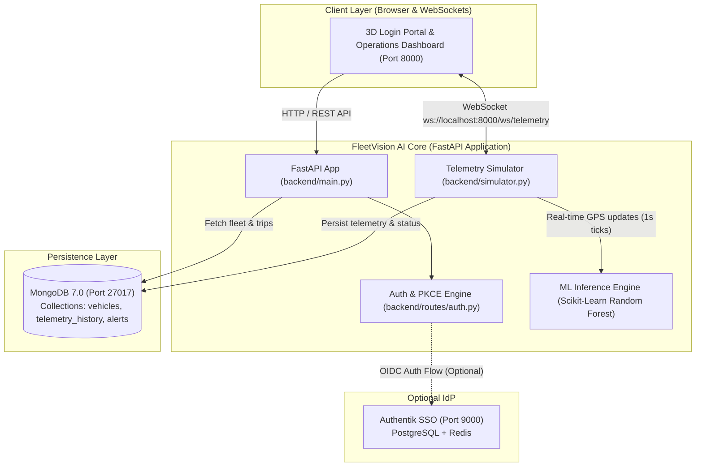

# 🚛 FleetVision AI — Complete Execution & Deployment Guide
### Multi-Service Architecture, Docker Orchestration, MongoDB & VS Code Integration

---

## 1. System Architecture & Execution Flow



---

## 2. Prerequisites

1. **Docker Desktop** installed and running on your system.
2. **Visual Studio Code** installed.
3. **Recommended VS Code Extensions** (open `.vscode/extensions.json` or search in Extensions tab):
   - **Docker** (`ms-azuretools.vscode-docker`)
   - **MongoDB for VS Code** (`mongodb.mongodb-vscode`)
   - **Python** (`ms-python.python`) + **Debugpy** (`ms-python.debugpy`)

---

## 3. Step-by-Step Execution Methods in VS Code

### Method 1: 🐳 100% Docker in VS Code (Production Stack — Easiest)

Runs both the **FastAPI Application** and **MongoDB** isolated in Docker containers.

#### Using VS Code Tasks:
1. Open Command Palette: `Cmd+Shift+P` (macOS) or `Ctrl+Shift+P` (Windows/Linux).
2. Type **`Tasks: Run Task`** and select:
   👉 **`🐳 Docker: Start Core Stack (App + MongoDB)`**

#### Using VS Code Integrated Terminal:
```bash
# 1. Build and start MongoDB and the FastAPI app in background
docker compose up -d --build

# 2. View live streaming logs from the application
docker compose logs -f app

# 3. Check container health and status
docker compose ps
```

#### Stopping the Stack:
```bash
docker compose down
```

---

### Method 2: ⚡ Hybrid Development in VS Code (Recommended for Coding)

Run **MongoDB in Docker**, but run the **FastAPI Python server directly in VS Code** with full F5 breakpoint debugging and hot-reloading!

#### Step 1: Start MongoDB container in terminal or via VS Code Task:
```bash
docker compose up -d mongodb
```
*(MongoDB will start on port `27017` with persistent data stored in Docker volume `mongo_data`)*

#### Step 2: Launch the Backend via F5 Debugger:
1. Open the **Run and Debug** sidebar in VS Code (`Cmd+Shift+D` or `Ctrl+Shift+D`).
2. Select **`🚀 FleetVision AI: FastApi Backend (F5 Debug)`** from the top dropdown.
3. Press **`F5`** (or click the green Play button).
4. The server starts with hot-reload enabled:
   ```
   INFO:     Uvicorn running on http://0.0.0.0:8000 (Press CTRL+C to quit)
   INFO:     Successfully connected to live MongoDB at mongodb://localhost:27017
   ```

---

### Method 3: 💻 Native Python Execution (No Docker Required)

FleetVision AI includes an automatic in-memory database fallback, allowing execution even if Docker is closed!

```bash
# 1. Activate virtual environment
source .venv/bin/activate

# 2. Start the server
python3 run.py
```

---

## 4. How to Inspect MongoDB in VS Code

### Using the Official "MongoDB for VS Code" Extension:
1. Click the **🍃 MongoDB leaf icon** in the VS Code Activity Bar (left sidebar).
2. Click **Add Connection** ➔ **Connect with Connection String**.
3. Paste the connection URI:
   ```
   mongodb://localhost:27017
   ```
4. Click **Connect**.
5. You will see the database **`fleetvision_ai`** with collections:
   - `vehicles` (14 commercial vehicles traversing Indian corridors)
   - `telemetry_history` (Live GPS, speed, fuel, bearing readings)
   - `alerts` (Real-time speed, weather, delay incidents)
   - `system_logs` (Security and authentication events)

### Using the Interactive Playground:
1. Open the pre-built playground file: [`scripts/mongo_playground.mongodb.js`](file:///Users/vishnukanthreddy/Documents/antigravity/login%20page/scripts/mongo_playground.mongodb.js).
2. Click the green **▶️ Execute** button in the editor toolbar (or press `Cmd+Option+R`).
3. View structured JSON queries and vehicle statistics directly in the split editor!

### Optional Mongo Express Web GUI:
If you prefer a browser-based database manager:
```bash
docker compose --profile tools up -d
```
Open **[http://localhost:8081](http://localhost:8081)** to browse collections visually!

---

## 5. Running the Authentik Identity Provider (Optional)

If you want to run the full local Authentik IdP alongside the app:
```bash
docker compose --profile auth up -d
```
- Authentik IdP will be accessible at **[http://localhost:9000](http://localhost:9000)**.
- *Note:* The application already includes **⚡ 1-Click Instant SSO Simulation** on the login screen, allowing full OIDC RBAC testing without running Authentik containers!

---

## 6. Access Endpoints & Verification

| Service | URL | Credentials / Notes |
| :--- | :--- | :--- |
| **FleetVision Login Portal** | [http://localhost:8000/](http://localhost:8000/) | 3D Interactive Login with 1-Click Persona chips |
| **Operations Dashboard** | [http://localhost:8000/dashboard](http://localhost:8000/dashboard) | Live OpenStreetMap, India Corridors & Telematics |
| **Public Showcase** | [http://localhost:8000/showcase](http://localhost:8000/showcase) | Marketing & System Overview |
| **MongoDB Port** | `localhost:27017` | Database: `fleetvision_ai` |
| **Mongo Express (Optional)**| [http://localhost:8081](http://localhost:8081) | Run with `--profile tools` |
| **Authentik IdP (Optional)** | [http://localhost:9000](http://localhost:9000) | Run with `--profile auth` |

### Pre-Configured Demo Accounts:
- **👑 Administrator**: `admin@fleetvision.ai` / `fleet2026` (or `admin` / `admin`)
- **🧭 Dispatch Manager**: `manager@fleetvision.ai` / `fleet2026` (or `manager`)
- **🚚 Vehicle Driver**: `user@fleetvision.ai` / `fleet2026` (or `driver`)
- **⚡ 1-Click Login**: Simply click any of the persona chips on the login card to auto-submit and enter!

### Health Check Verification:
```bash
# Verify API health
curl -s http://localhost:8000/api/health

# Verify vehicles seeded in database
curl -s http://localhost:8000/api/vehicles | grep -o '"vehicle_id"' | wc -l
```
